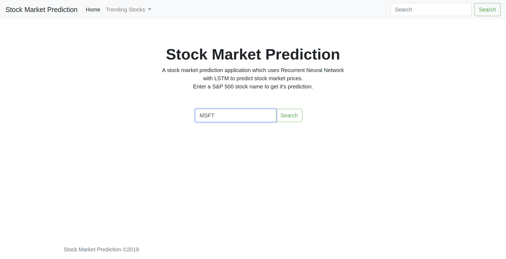
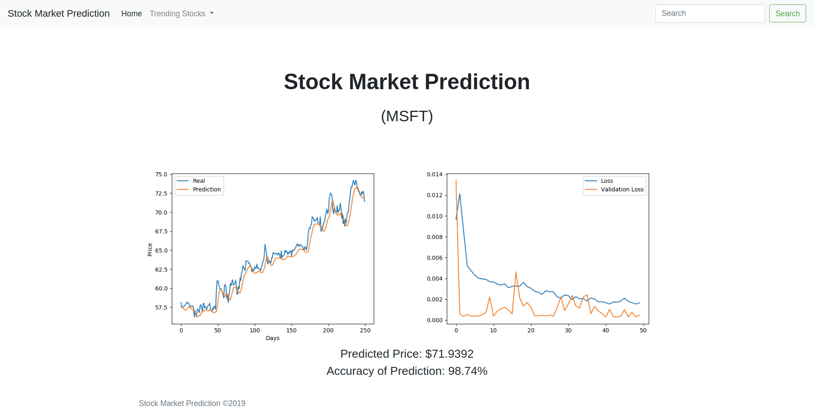

# Stock Market Prediction

Predicting stock market prices using Recurrent Neural Network with LSTM.

## Requirements
- Python 3.6
- Flask = 1.1.1
- numpy = 1.17.2
- pandas = 0.25.1
- scikit-learn = 0.21.3
- tensorflow = 1.14.0
- matplotlib = 3.1.1

Use Anaconda as a package manager to easily set up the environment before running the application.

## Setup

Download the [dataset](https://www.kaggle.com/camnugent/sandp500#all_stocks_5yr.csv) and create a empty folder named "dataset" and place the file in it.

## Running the app

- Start the flask server `$ python app.py`
- Navigate to `localhost:5000`

